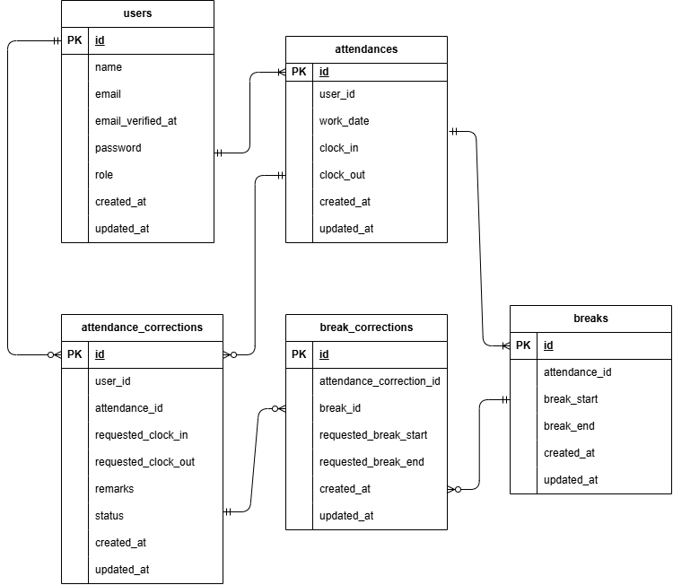

# 勤怠管理アプリ

## 環境構築
### リポジトリをクローン
'''bash
git clone https://github.com/Naru412/laravel-attendance.git
'''

### プロジェクトへ移動
'''bash
cd laravel-attendance
'''

### Dockerを起動
'''bash
docker compose up -d --build
'''
### phpコンテナへ入る
'''bash
docker-compose exec php bash
'''

### composerがインストールされているか確認
'''bash
composer install
'''

### 環境変数を作成
'''bash
cp .env.example .env
'''
### .envのDB設定を以下のように変更
 - DB_CONNECTION=mysql
 - DB_HOST=mysql
 - DB_PORT=3306
 - DB_DATABASE=laravel_db
 - DB_USERNAME=laravel_user
 - DB_PASSWORD=laravel_pass

### アプリケーションキーを生成
'''bash
php artisan key:generate
'''
### マイグレーション・シーディング
'''bash
php artisan migrate:fresh --seed
'''

## 使用技術
 - php:8.1-fpm
 - nginx:1.21.1
 - mysql:8.0.26
 - phpmyadmin/phpmyadmin
 - Laravel 8.83.29

## 開発環境
 - 一般ユーザーログイン : http://127.0.0.1/
 - 管理者ログイン : http://127.0.0.1/admin/login
 - phpMyAdmin : http://localhost:8080

## テストアカウント
### 一般ユーザー
 - メールアドレス：user1@example.com
 - パスワード：password

 - メールアドレス：user2@example.com
 - パスワード：password
### 管理者
 - メールアドレス：user3@example.com
 - パスワード：password

## ER図
